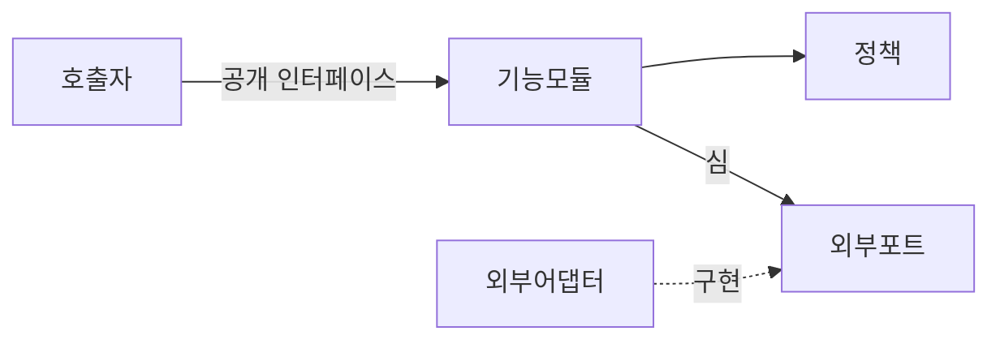
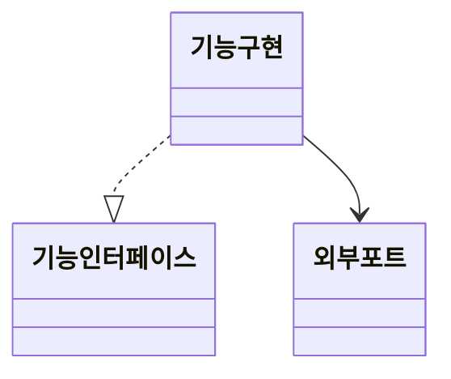
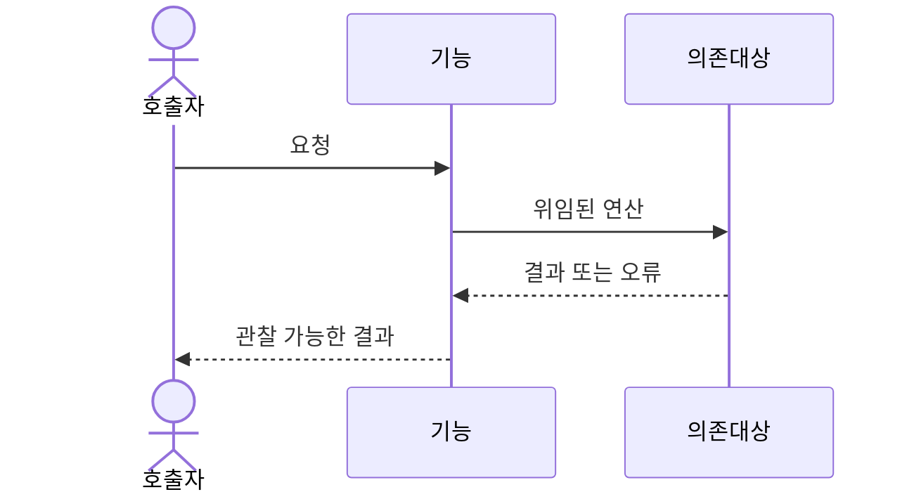

# 기능 설계 출력 계약

최종 응답에 이 구조를 사용한다. 조건부 섹션은 실제로 적용되지 않을 때만 생략하며, 구조 다이어그램 또는 TDD 전략은 절대로 생략하지 않는다.

## 1. 목표와 제약 조건

- 기능 목표와 관찰 가능한 결과를 명시한다.
- 범위에 포함되는 동작과 포함되지 않는 동작을 정의한다.
- 확정된 제약 조건, 호환성 요구사항, 가정 및 명시적으로 연기한 문제를 나열한다.

## 2. 현재 아키텍처와 영향

- 관련된 기존 모듈, 인터페이스, 심, 어댑터 및 데이터 흐름을 요약한다.
- 변경으로 영향받는 파일과 계약을 식별한다.
- 지역성, 레버리지, 결합도 및 인터페이스 깊이를 사용해 아키텍처상의 마찰 또는 기회를 설명한다.

## 3. 결정과 소유권

간결한 표를 사용한다.

| 관심사 | 소유자 | 검토한 대안 | 결정 및 근거 |
| --- | --- | --- | --- |

사용자와의 대화를 통해 도달한 결정을 포함한다. 합의된 결정과 가정을 구분한다. 저장소 문서를 변경해야 하지만 사용자가 수정을 허가하지 않았다면, 제안하는 용어집 또는 ADR 변경을 여기에 나열한다.

## 4. 제안 설계

### 모듈과 파일

| 모듈 또는 구성 요소 | 책임 | 인터페이스/호출자 | 의존성 | 파일 작업 |
| --- | --- | --- | --- | --- |

“모듈 또는 구성 요소”를 넓은 의미로 사용한다. 클래스, 인터페이스/프로토콜, 함수 모듈, 상태 소유자, 데이터 타입, 어댑터 또는 패러다임에 적합한 다른 단위일 수 있다.

### 구현 경계

- 합의된 생성, 변경 또는 삭제 대상 파일 목록을 엄격한 구현 경계로 취급한다.
- 목록에 없는 파일에 대한 작업이 구현에 필요하다면, 사용자가 “묻지 말고 해”와 같이 자동 진행 의사를 명시적으로 밝힌 경우가 아닌 한 진행하기 전에 반드시 사용자에게 명시적인 확인을 받는다.
- 합의된 설계를 넘어서는 동작, 범위 또는 파일 변경은 절대 구현하지 않는다.

### 공개 계약과 데이터 흐름

언어에 적합한 시그니처 또는 의사 코드를 제시한다. 관련이 있는 경우 호출자에게 보이는 불변조건, 유효성 검사, 결과, 오류, 순서, 멱등성, 부수 효과 및 성능 제약 조건을 설명한다. 구현 세부사항은 인터페이스 뒤에 숨긴다.

### 실패 및 호환성 동작

적용 가능한 경우 의미 있는 실패 경로, 수명주기 또는 동시성 위험, 호환성, 마이그레이션, 출시 및 관측 가능성을 다룬다. 국소적인 기능을 위해 인프라 관련 관심사를 지어내지 않는다.

## 5. SOLID 및 깊이 검토

적용 가능한 SOLID 원칙이 설계에 어떤 영향을 주었는지 설명한다. 원칙을 억지로 적용하지 말고 적용되지 않는 원칙을 명시한다. 각각의 새로운 추상화 또는 심이 정당한 이유, 그것이 숨기는 복잡성 및 삭제 테스트가 예측하는 결과를 기록한다.

## 6. 다이어그램

항상 Mermaid 구조/의존성 다이어그램을 포함한다. 설계가 클래스 중심이 아니라면 중립적인 다이어그램을 선호한다.

실제 패러다임을 설명할 때만 클래스 다이어그램을 사용한다.

여러 모듈 또는 심에 걸친 순서가 중요할 때 시퀀스 다이어그램을 추가한다.

모든 템플릿 이름과 화살표를 실제 설계에 맞게 바꾼다. 다이어그램 방향이 의존성 설명과 일치하는지 확인한다.

## 7. TDD 구현 전략

### 요구사항 추적성

| 요구사항 | 공개 동작 | 테스트 수준 | 소유자/인터페이스 | 우선순위 |
| --- | --- | --- | --- | --- |

### 수직 슬라이스

각 트레이서 불릿에 대해 다음을 명시한다.

1. **RED** — 추가할 단 하나의 관찰 가능한 동작 테스트와 그 테스트가 처음에 반드시 실패해야 하는 이유.
2. **GREEN** — 테스트를 통과하는 데 필요한 최소한의 프로덕션 동작.
3. **REFACTOR** — 테스트 통과 후에만 허용되는 정리 작업. 이제 증거로 뒷받침되는 SOLID 개선을 포함한다.

가장 얇은 엔드투엔드 성공 경로부터 중요한 실패와 변형까지 슬라이스 순서를 정한다. 페이크 또는 목이 필요한 실제 외부 심을 식별하고, 그 외에는 실제 내부 모듈을 사용한다.

## 8. 인수 체크리스트

- 모든 요구사항에 소유자와 관찰 가능한 테스트가 있다.
- 공개 인터페이스에 필요한 불변조건과 오류 동작이 포함되어 있다.
- 파일 배치가 책임 소유권을 따른다.
- 다이어그램이 작성된 의존성 및 동작과 일치한다.
- 의미 있는 선택에 합의했으며 남은 가정이 명시되어 있다.
- TDD 슬라이스를 Red-Green-Refactor 순서로 독립적으로 실행할 수 있다.
- 구현 경계와 계획에 없던 파일 작업에 대한 확인 요건이 명시되어 있다.
- 어떤 구현 단계도 합의된 설계를 넘어서지 않는다.
