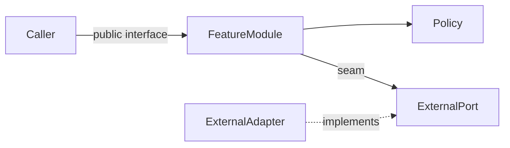
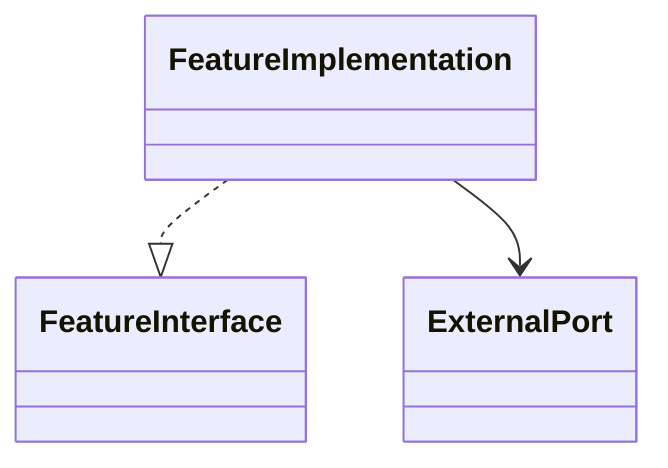
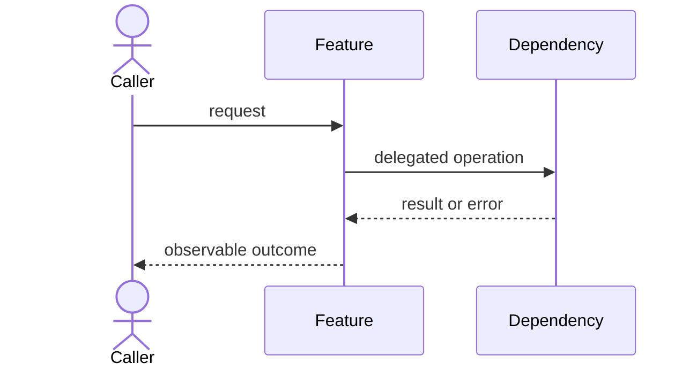

# Feature Design Output Contract

Use this structure for the final response. Omit a conditional section only when it genuinely does not apply; never omit the structural diagram or TDD strategy.

## 1. Goal and constraints

- State the feature goal and observable outcomes.
- Define in-scope and out-of-scope behavior.
- List confirmed constraints, compatibility requirements, assumptions, and any explicitly deferred issue.

## 2. Current architecture and impact

- Summarize the relevant existing modules, interfaces, seams, adapters, and data flow.
- Identify files and contracts affected by the change.
- Explain the architectural friction or opportunity using locality, leverage, coupling, and interface depth.

## 3. Decisions and ownership

Use a compact table:

| Concern | Owner | Alternatives considered | Decision and rationale |
| --- | --- | --- | --- |

Include decisions reached through the user dialogue. Distinguish agreed decisions from assumptions. If repository documentation should change but the user did not authorize edits, list the proposed glossary or ADR update here.

## 4. Proposed design

### Modules and files

| Module or construct | Responsibility | Interface/callers | Dependencies | File action |
| --- | --- | --- | --- | --- |

Use "module or construct" broadly: it may be a class, interface/protocol, function module, state owner, data type, adapter, or another paradigm-appropriate unit.

### Implementation boundary

- Treat the accepted list of files to create, modify, or delete as a hard implementation boundary.
- If implementation requires work on any file outside that list, obtain explicit user confirmation before proceeding unless the user has explicitly authorized automatic progression, for example, "don't ask, just do it."
- Never implement behavior, scope, or file changes beyond the accepted design.

### Public contracts and data flow

Design in enough detail that a developer can implement directly from this design document alone, without needing to invent function signatures, interface shapes, ownership, data flow, failure semantics, or test boundaries.

Give language-appropriate signatures or pseudocode as a required contract, not an optional sketch. Always include signatures for interfaces connected to end users or common-feature users such as developers, and for every important function or interface named in the design. Include the function, method, interface, event, callback, or command name; input parameters and types; return type or result shape; asynchronous, concurrent, or paradigm-specific execution behavior; caller-visible error/result contract; and important side effects or idempotency constraints. Describe caller-visible invariants, validation, results, errors, ordering, side effects, and performance constraints only where relevant. Keep implementation details behind the interface.

### Failure and compatibility behavior

Cover meaningful failure paths, lifecycle or concurrency hazards, compatibility, migration, rollout, and observability where applicable. Do not invent infrastructure concerns for a local feature.

## 5. SOLID and depth review

Explain how applicable SOLID principles shaped the design. Name principles that do not apply rather than forcing them. Record why each new abstraction or seam is justified, what complexity it hides, and what the deletion test predicts.

## 6. Diagrams

Always include a Mermaid structure/dependency diagram. Prefer a neutral diagram when the design is not class-oriented:

Use a class diagram only when it describes the actual paradigm:

Add a sequence diagram when ordering across modules or seams matters:

Replace all template names and arrows with the real design. Ensure diagram direction agrees with the dependency description.

When diagrams would reduce implementation ambiguity, include as many as are useful: dependency/structure, sequence, state, data flow, lifecycle, or module boundary diagrams. Diagrams must clarify implementation decisions rather than decorate the document, and every diagram must agree with the written responsibilities, call direction, state transitions, and data flow.

## 7. TDD implementation strategy

### Requirement traceability

| Requirement | Public behavior | Test level | Owner/interface | Priority |
| --- | --- | --- | --- | --- |

### Vertical slices

For each tracer bullet, state:

1. **RED** — the single observable behavior test to add and why it must fail initially.
2. **GREEN** — the minimum production behavior needed to pass it.
3. **REFACTOR** — cleanup allowed only after green, including any SOLID improvement now supported by evidence.

Order slices from the thinnest end-to-end success path through important failures and variations. Identify genuine external seams requiring fakes or mocks; use real internal modules otherwise.

## 8. Acceptance checklist

- Every requirement has an owner and observable test.
- Public interfaces include necessary invariants and error behavior.
- The design document is detailed enough for a developer to implement without inventing function signatures or interface shapes.
- Interfaces connected to end users, common-feature users such as developers, and every important function/interface named in the design include signatures.
- File placement follows responsibility ownership.
- Necessary diagrams are included, and every diagram matches the written dependencies and behavior.
- Meaningful choices are agreed; remaining assumptions are explicit.
- TDD slices are independently executable in red-green-refactor order.
- The implementation boundary and the confirmation requirement for unplanned file work are explicit.
- No implementation step exceeds the accepted design.
